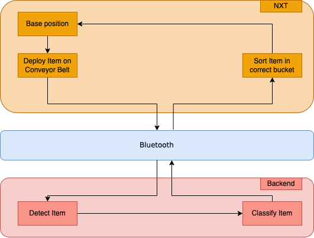

# Group name
**Group members**: Filip Rejmus, Sang Woo Bae, Tristan Brech, Timo Oeltze, Luca Jungnickel, Richardt Joergensen

## Project overview

Over the course of this project we created a Assembly Line Robot that is able to sort stones according to their color and size while also detecting objects that aren't expected in the assembly line.

### Goals

Our goals for this project were:

- A reliable system detecting and sorting lego stones while sorting out unwanted objects
- A scalable and adaptable assembly line robot

### Requirements
There were multiple necessary requirements for this project.
Firstly, we were limited to using NXT controllers with very limited space and memory.

Our Assembly line had to

- Be able to sort objects according to their color and shape
- Sort accurately and efficiently
- Utilize the extremely limited NXT Brick as the robot controller.

### Approach

We assigned each component of our system architecture to two members of our group.
We defined the system specifications early and rigidly sticked to them throughout the project.
This allowed us to integrate our system continously and left space for the introduction of new hardware and software features.

## System architecture & Software design
Our project consisted of three main components that each respective team worked on: The Backend, the Robot Controller and the Bluetooth component. The Backend was programmed in C++ and is functioning as the eyes of our controller. It instructs our NXT Brick via Bluetooth to place objects on the conveyor and analyzes the image to command the controller to the right bucket. The NXT Brick takes the form of a state machine that gets triggered to take a specific state by the commands arriving over bluetooth. It is programmed in C and NXTOsek, a custom C based OS for the controller hardware. The communication interfaces were exposed in both environments as high level interfaces that represent the different stages of our sorting logic as presented in the chart.

### Robot design

Our robot consists of:
- main moveable robot with NXT brick
- tracks for the robot
- boxes to sort in 
- dispenser for the lego bricks at one side of the tracks

The main robot has an assembly line attached. This robot unit drives to the dispenser to get a new stone.
The dispenser consists of a tower filled with Lego stones, as well as a horizontal motor-controlled pusher.
We chose the combination of the pusher and the tower like that, so it is only possible to eject one lego stone at a time. A difficulty was to only drop one stone at a time in combination with different stones. The solve this problem, we narrowed the slot of the Lego tower, until it had the correct size.
Our main robot has two touch sensors, one attached to each side. These are for calibration purposes and safety features. If a touch sensor is hit while the robot is not expecting it, the robot will recalibrate.
On each box is a white Lego stone attached. We call them 'calibration stones'. They are recognized by the robot's light sensor. If the light sensor is over a calibration stone, the robot is in the correct position to drop a stone from the assembly line into the box.
Above the assembly line, the Raspberry PI camera is attached. This way, the assembly line can be analyzed and the correct element on the line recognized.

### Algorithms
Let'stake a look at the process of analysing a picture:

1. read the picture
1. convert picture from RGB to HSV
1. define masks for each color to be detected
1. dilate masks

 **for each color:**

5. remove all pixels that aren't that color
1. get the area and number of non-zero pixels
1. check whether it exceeds a minimum required size, so that no small colored pixels on the assembly line get detected as objects
1. check in which category the size of the object belongs and set variables
1. set varibale for the color detected 

## Summary
We achieved all goals and requirements, but with certain limitations. Color detection works reliable, but size detection works only for 2x2 and 2x4 lego pieces reliably. Objects that have the same or similiar size as the 2x2 and 2x4 lego pieces and are one of our chosen colors could also be misinterpreted as lego pieces. To fix those problems would be a difficult task that requires more time than we had available in the end. With enough lego pieces, the assembly line is adaptable to contain a variable size of containers.

### Lessons learned
We learned that having an integrated system to test on earlier would have been helpful, especially to recognize problems with size detection early on. We also underestimated the work required and problems occurring when it comes to establishing the bluetooth connection which pushed the integrated system further back than anticipated. Another possibility would have been to build a machine learning algorithm form the beginning for better and more reliable color and object detection.

### Future work
We would try to better the size detection, either by improving it with our current method with OpenCV or by using machine learning to detect different object.

